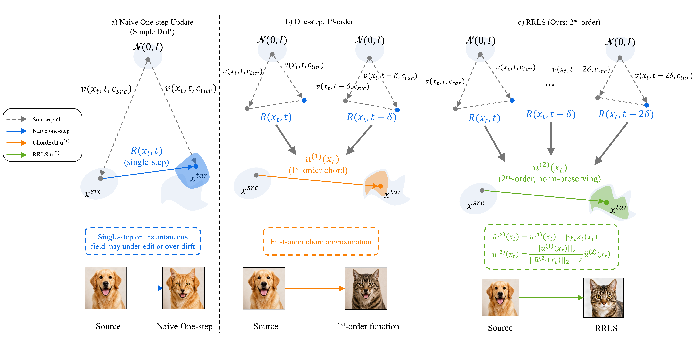

<div align="center">
  
  
  <h1>Bridging the Manifold Gap: Riemannian Residual Line Search for One-Step Image Editing</h1>

  <a href="https://arxiv.org/abs/2606.24844"></a>

  <p>
    <a href="#overview">Overview</a> •
    <a href="#quick-start">Quick Start</a> •
    <a href="#pipeline">Pipeline</a> •
    <a href="#evaluation">Evaluation</a>
  </p>
</div>

## Overview



RRLS is a source-preserving image editing method. It first produces a baseline edit, then generates a stronger candidate, and finally selects a residual candidate that better balances prompt alignment with source preservation.

## Quick Start

### Dependency

RRLS needs:
- Python 3.12
- PyTorch 2.5.0
- PIE-Bench data, please refer to [PnPInversion](https://github.com/cure-lab/PnPInversion)
- Local Stable Diffusion Turbo [checkpoint](https://huggingface.co/stabilityai/sd-turbo)
- Local CLIP ViT-L/14 [checkpoint](https://huggingface.co/sentence-transformers/clip-ViT-L-14) for evaluation

`DINO ViT-B/8` is downloaded automatically by `torch.hub` during structure-distance evaluation.

### Installation

```bash
pip install -r requirement.txt
```

Put the model weights at the default path or pass `--model-root`:

```text
./sd-turbo/
  unet/
  scheduler/
  text_encoder/
  tokenizer/
  vae/
```

Put PIE-Bench at the default path or pass `--pie-root`:

```text
./pie_bench/
  annotation_images/
  mapping_file.json
```

## Demo

```bash
python app.py
```

The demo uses the same default model layout and loads local examples from `images/` when available.

### Pipeline

Run the full export pipeline with:

```bash
bash run_pipeline.sh
```

By default it writes:
- `pie_bench/output/ChordEdit/annotation_images`
- `pie_bench/output/RRLSStrong/annotation_images`
- `pie_bench/output/RRLS/annotation_images`

## Evaluation

Evaluation is performed on PIE-Bench. It reads source images from `pie_bench/annotation_images`, annotations from `pie_bench/mapping_file.json`, and method outputs from `pie_bench/output/<method>/annotation_images`.

Run the full evaluation with:

```bash
bash run_eval.sh
```

By default it writes results to `pie_bench/eval/`:
- `per_sample_metrics.csv`
- `structure_metrics.csv`
- `summary_metrics.csv`
- `paired_stats.csv`

